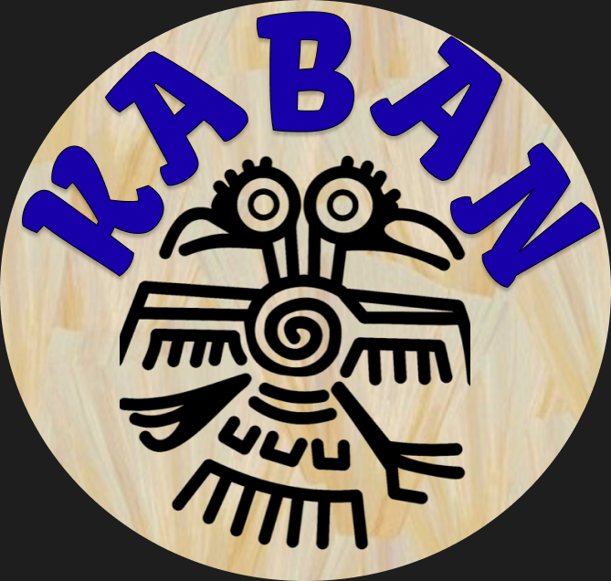

# Kaban

Centralize your own research material and consult it with the power of AI and LLMs.
As easy as asking ChatGPT to assist you on your research!

<div align="center">
    
</div>

## Motivation

As starter [researchers](https://en.wikipedia.org/wiki/Research) ourselves, we have faced a common problem that you may have faced as well, even if you are not exactly a researcher: keeping track of multiple files and other sources of information that are essential to your work.

How do you recall a particular feature of that specific contribution to the current literature?
In what paper did you read it?
What was the main source that helped that author to develop her novel algorithm and how did she adapt it to her particular problem?

We thought of Kaban as an [AI](https://en.wikipedia.org/wiki/Artificial_intelligence) tool to assist researchers with their own material and references of information, such as [academic papers](https://en.wikipedia.org/wiki/Academic_publishing#Scholarly_paper) and [scientific articles](https://en.wikipedia.org/wiki/Scientific_literature#Scientific_article).
More than being able to just respond contextless questions like *What is the main topic of these papers?*, we aim to exploit the potential of [Large Language Models (LLMs)](https://en.wikipedia.org/wiki/Large_language_model), such as [ChatGPT](https://en.wikipedia.org/wiki/ChatGPT), and provide a powerful assistance tool at hand to speed up and improve the research process very commonly found in academia.

We know that in this process, researchers have their own collection of material relevant to their topic.
They may have not read it all, but are at least familiar with each one of the references and their contents.
At this point, in the researcher's mind often arise *specific* questions related to particular sections of their work which of course must be appropriately cited, and this is where we wanted a smart tool to help with.

For example, when writing your paper, you may wonder: *How many values did these authors use in the experiment to calibrate the alpha parameter of the algorithm? And why that range?*
Of course, the fact that you *have* that question means you read that section in one of your papers (and hopefully understood it), but you may not remember the specifics of that particular experiment.
Why wasting time looking into your dozens of files when you could just ask an AI to refresh your memory, or to tell you where exactly the authors described that?

Think of Kaban as your personalized ChatGPT, which is already trained on human language, with the plus of having your own research material as a knowledge base that it can consult, query, summarize, connect, and organize based on your prompts.

As a note, this is not saving you from actually reading your papers.
Most if not all serious academics agree in that no matter how powerful the AI gets, researchers *must* read their sources.
But that does not stop you to use a simple `Ctrl + F` that shows you a paragraph that you already know what it is about.
Kaban takes that to a whole new and intelligent level, thanks to the current capability and future potential of AI and specifcially LLMs.

## Background and origin

<div align="center">
    
</div>

Kaban was born as one of the projects for the [HackMTY 2023](https://hackmty.com/), the largest [hackathon](https://en.wikipedia.org/wiki/Hackathon) in Latin America.
The challenge was to create a novel application of a smart search engine using large language models.

In the 24 hours span of the hackathon, we only managed to finish a simple demo, which placed us among the top 10 finalists of the contest, out of +100.
We are excited to see what more features we can show to the community now that we have more time!

*— SU Group*

### Frontend

As part of the hackathon we developed a [UI for this project]((https://github.com/David-Lazaro-Fernandez/smart-study)).
We plan on improving and releasing it soon.

### Demo


# Local development

To run this repository in your local machine you need:

- [Python 3](https://www.python.org/downloads/)
  - We specifically used Python 3.11

Create a [virtual environment](https://packaging.python.org/en/latest/guides/installing-using-pip-and-virtual-environments/#creating-a-virtual-environment):

```ps
python -m venv venv
```

And activate it (PowerShell example):

```ps
venv\Scripts\Activate.ps1
```

Then run the following to install required packages:

```ps1
pip install -r requirements.txt
```

Requirements may change: for now there is no guarantee of compatibility with older versions of the repository.

1. Create an Open AI account and [generate an API key](https://platform.openai.com/account/api-keys).
   - Unless you got free credits, you will have to pay for the use of the API. [Check the fees here](https://openai.com/pricing).
2. Create an `.env` file with your API key:
```toml
OPENAI_API_KEY=<your secret key>
```
4. Put your PDF files in the [`/data/pdfs/`](./data/pdfs/) directory.
5. Run the Jupyter notebook [`/src/llm/showcase.ipynb`](/src/llm/showcase.ipynb) with your own questions!
